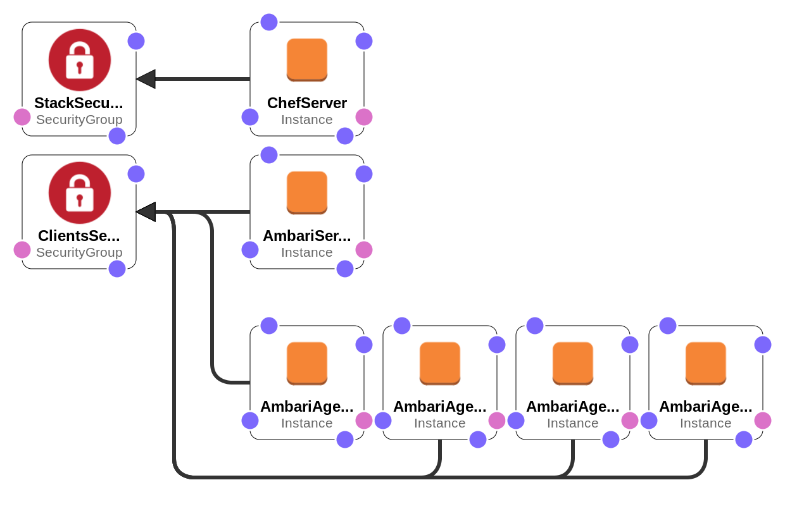

A Hadoop Cluster on AWS with AWS CloudFormation and Chef
========================================================

Summary
-------

This is a combination of a Chef recipe and a AWS CloudFormation template that deploys a cluster with Apache Spark, Apache Hadoop, Apache Hive and lots of other important stuff on Amazon EC2 on-demand instances.

Decription of Components
------------------------

This cluster consists of the following components (listed along with pre-selected values in the CloudFormation template):

- a Chef server (t2.medium: 2 vCPU, 4 GiB RAM, ami-cc5a23db)
- an Ambari server (r3.large: 2 vCPU, 15.25 GiB RAM, ami-6d1c2007 (CentOS 7))
- four working nodes, Ambari agents (r3.large: 2 vCPU, 15.25 GiB RAM, ami-6d1c2007 (CentOS 7))
- all the components share the same VPC and subnet
- StackSecurityGroup for the Chef server
- ClientsSecurityGroup for all the Chef clients — Ambari server and Ambari agents

Deployment Flow
---------------

The main entry point for the process of the deployment of the cluster is `deploy.sh` script. In short, what it does is:

1. Fetches some information about the network setup on your AWS account to know where machines should go (VPC, subnet)
2. Issues a request to AWS CloudFormation with a template (`_cloud_formation_template/HadoopCluster.template` file) that describes what components we want to have (see the Description of Components paragraph).
3. Configures the Chef server — creates an administrator, an organization; gets private keys; uploads cookbooks onto it.
4. Bootstraps nodes — Chef clients. The roles of the nodes are available in the `roles` directory. During the bootsraping process Chef server installs one Ambari server and multiple Ambari agents on the clients.
5. After Ambari has been installed on all the nodes, Chef issues one new request to the Ambari server with a [blueprint](https://cwiki.apache.org/confluence/display/AMBARI/Blueprints) (cookbooks/ambari-server/files/blueprint-default) describing what software we want to see on the agents in its body — Spark, Hadoop, YARN, Hive etc.
6. After the installation process of the software described in the blueprint has finished the cluster is ready to computations.

Helper Scripts
--------------

Prerequisites
-------------

1. Ensure that a VPC the cluster is to be deployed on resolves private hostnames within a subnetwork. (AWS -> VPC -> Select VPC -> Edit DNS Hostnames -> DNS Hostnames -> Yes)
2. Ensure that AWS CLI is configured (See: http://docs.aws.amazon.com/cli/latest/userguide/cli-chap-getting-started.html)
3. Set postgres credentials in the databag: `./data_bags/postgres/config.json`
4. Set the location of the AWS private key in the `deploy.sh:6` - a script in the root directory of the repository. It's needed to reach ec2 instances via ssh `deploy.sh:56-59`. (http://docs.aws.amazon.com/AWSEC2/latest/UserGuide/AccessingInstancesLinux.html)
5. Define variables with which the Chef Server is to be configured in the `deploy.sh:32` (refer to this page for more information (items 5-6): https://docs.chef.io/install_server.html)

After you have checked all the requirements you are ready to proceed by running the script that deployes the cluster: `./deploy.sh`
